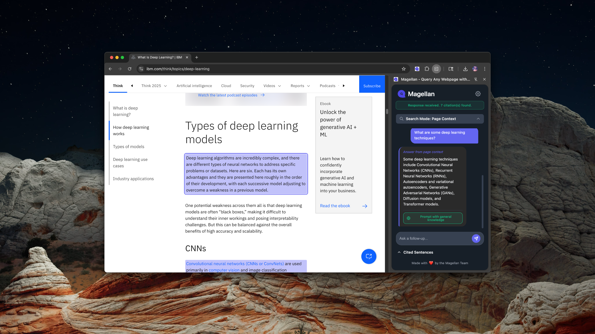

# Magellan - AI-Powered Web Page Assistant

[](https://opensource.org/licenses/MIT)
[](CONTRIBUTING.md)

[](https://chromewebstore.google.com/detail/magellan/ekkajebdacenikgmbgkdnmememnlibnd)

Magellan is an open-source Chrome extension that brings conversational AI to your web browsing experience. It allows you to ask questions about the web page you're currently viewing and get AI-powered answers with smart citations.



## 🌟 Features

- 💬 **Conversational AI** – Ask questions and get answers directly from the page, powered by Google Gemini
- 🔗 **Smart Citations** – See exactly where each answer comes from, with toggleable highlights and one-click navigation
- 🧠 **Context-Aware Tabs** – Each tab keeps its own chat and memory, so your questions stay relevant to the content you're viewing
- 📜 **Citation Recall** – Pull up sources from earlier in the chat, even if you've moved on
- 🚀 **Seamless Navigation** – Effortlessly jump to the right spot with smooth scrolling and intuitive controls
- 🧼 **Sleek, Responsive UI** – Clean design that fits right into your browser workflow
- 💸 **100% Free** – No subscriptions, no paywalls, no data harvesting

## 🚀 Quick Start

1. Install Magellan from the [Chrome Web Store](https://chromewebstore.google.com/detail/magellan/ekkajebdacenikgmbgkdnmememnlibnd)
2. Get your Google Gemini API key:
   - Visit [Google AI Studio](https://makersuite.google.com/app/apikey)
   - Create a new API key
   - Click the Magellan extension icon in your browser toolbar
   - Enter your API key in the settings
3. Start using Magellan:
   - Click the Magellan icon in your Chrome toolbar to open the sidebar
   - Type your question about the current page
   - Get AI-powered answers with highlighted citations
   - Click citations to navigate to the relevant parts of the page

💡 **Pro Tip**: For quick access, set up a keyboard shortcut in Chrome's extension settings:

1. Go to `chrome://extensions/shortcuts`
2. Find Magellan in the list
3. Set your preferred keyboard shortcut for "Activate the extension"

## 🛠️ Development

### Building from Source

1. Clone the repository:

   ```bash
   git clone https://github.com/magellan-extension/magellan.git
   ```

2. Load the extension in Chrome:

   - Open Chrome and go to `chrome://extensions/`
   - Enable "Developer mode" in the top right
   - Click "Load unpacked" and select the `magellan` repository

3. Make your changes to the source code
4. Test the extension locally using Chrome's developer mode
5. Submit a pull request with your changes

### Project Structure

```
magellan/
├── src/                    # Source code
│   ├── js/                # JavaScript files
│   │   ├── api-key.js     # API key management
│   │   ├── background.js  # Background service worker
│   │   ├── google-ai.js   # Google AI SDK integration
│   │   └── sidebar.js     # Main UI and interaction logic
│   └── html/              # HTML files
├── public/                # Static assets
├── docs/                  # Documentation
└── manifest.json          # Chrome extension manifest
```

## 🤝 Contributing

We welcome contributions! Please see our [Contributing Guide](CONTRIBUTING.md) for details on:

- How to submit issues and feature requests
- Our development process
- Pull request guidelines

## 📝 License

This project is licensed under the MIT License - see the [LICENSE](LICENSE) file for details.

## 🌐 Links

- [Chrome Extension](https://chromewebstore.google.com/detail/magellan/ekkajebdacenikgmbgkdnmememnlibnd)
- [Website](https://kpulgari.com/magellan/)
- [Issue Tracker](https://github.com/magellan-extension/magellan/issues)
- [Documentation](docs/)

---

Star us on GitHub if you find this project helpful! Thanks!
