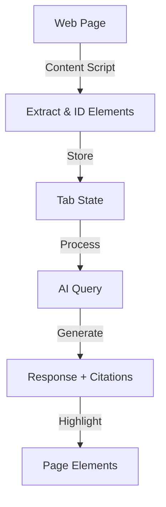

# Magellan Architecture

This document outlines the technical architecture of Magellan, with a focus on how we handle page data extraction, processing, and interaction.

## Overview

Magellan is built as a Chrome extension with three main components:

1. Background Service Worker (`background.js`)
2. Sidebar UI (`sidebar.js`)
3. Content Scripts (injected into web pages)

The core functionality revolves around extracting, processing, and interacting with webpage content through AI.

## Page Data Flow



## Page Content Extraction

### Element Selection

We use a targeted approach to extract meaningful content:

```javascript
const selectors =
  "p, h1, h2, h3, h4, h5, h6, li, span, blockquote, td, th, pre," +
  "div:not(:has(p, h1, h2, h3, h4, h5, h6, li, article, section, main, aside, nav, header, footer, form)), " +
  "article, section, main";
```

This selector strategy:

- Prioritizes semantic HTML elements
- Excludes container elements that don't add value
- Captures both block and inline elements
- Avoids duplicate content

### Element Processing

Each element goes through several checks:

1. **Visibility Check**

   - Filters out hidden elements
   - Checks computed styles (display, visibility, opacity)
   - Verifies element dimensions
   - Excludes off-screen elements

2. **Content Validation**

   - Minimum text length: 15 characters
   - Maximum text length: 2500 characters per node
   - Filters out duplicate content
   - Removes empty or whitespace-only elements

3. **Element Identification**
   - Assigns unique IDs (`mgl-node-{counter}`)
   - Stores element references
   - Maintains parent-child relationships
   - Preserves DOM structure

### Content Storage

Extracted content is stored in two formats:

1. **Identified Elements**

```typescript
type IdentifiedElement = {
  id: string; // Unique identifier (e.g., "mgl-node-0")
  text: string; // Extracted text content
  element: Element; // Reference to DOM element
};
```

2. **Full Text Format**

```
[mgl-node-0] First paragraph text
[mgl-node-1] Second paragraph text
...
```

## State Management

### Tab State

Each tab maintains its own state:

```typescript
type TabState = {
  chatHistory: Array<{
    role: "user" | "assistant";
    content: string;
    citations?: Array<CitedSentence>;
  }>;
  citedSentences: Array<CitedSentence>;
  currentCitedSentenceIndex: number;
  status: "idle" | "extracting" | "querying_llm" | "ready" | "error";
  errorMessage: string;
  fullPageTextContent: string;
  pageIdentifiedElements: Array<IdentifiedElement>;
};
```

### State Lifecycle

1. **Initialization**

   - Created when tab is activated
   - Persists until tab is closed
   - Maintains chat history and citations

2. **Updates**
   - Modified during content extraction
   - Updated with AI responses
   - Tracks citation navigation
   - Manages error states

## AI Integration

### Query Processing

1. **Context Preparation**

   - Combines user query with page content
   - Formats element IDs and text
   - Maintains conversation history

2. **Prompt Structure**

```
You are an AI assistant helping a user understand the content of a webpage.
The user has asked: "{query}"

Here is the relevant text content extracted from the page. Each piece of text is preceded by its unique element ID in square brackets (e.g., [mgl-node-0]).

--- START OF PAGE CONTENT ---
{formattedContent}
--- END OF PAGE CONTENT ---

Please:
1. Provide a concise answer based *only* on the provided content
2. Identify up to {numCitations} element IDs that support your answer
```

### Response Handling

1. **Citation Extraction**

   - Parses AI response for element IDs
   - Validates IDs against stored elements
   - Creates citation objects

2. **UI Updates**
   - Updates chat history
   - Renders citations
   - Manages highlights
   - Updates navigation state

## Highlight Management

### Highlight Types

1. **Cited Element Highlight**

   - Class: `mgl-cited-element-highlight`
   - Style: Light background with rounded corners
   - Purpose: Shows all cited elements

2. **Active Element Highlight**
   - Class: `mgl-active-element-highlight`
   - Style: Outline with shadow
   - Purpose: Indicates currently viewed citation

### Highlight Operations

1. **Application**

   - Injects CSS styles
   - Adds highlight classes
   - Maintains element references
   - Handles visibility toggling

2. **Navigation**
   - Scrolls to active element
   - Updates highlight states
   - Manages focus
   - Handles edge cases

## Performance Considerations

1. **Content Extraction**

   - Processes elements in batches
   - Uses efficient selectors
   - Implements early filtering
   - Caches results

2. **Memory Management**

   - Cleans up old highlights
   - Removes unused element IDs
   - Manages tab state lifecycle
   - Handles page unload

3. **UI Responsiveness**
   - Asynchronous processing
   - Progressive loading
   - Efficient DOM operations

## Security

1. **Content Isolation**

   - Sandboxed content scripts
   - Limited DOM access
   - Secure message passing
   - API key protection

2. **Data Handling**
   - Local storage only
   - No external data transmission
   - Secure API communication
   - Privacy-focused design

## Error Handling

1. **Extraction Errors**

   - Invalid selectors
   - DOM access issues
   - Content parsing failures
   - Memory constraints

2. **AI Integration Errors**

   - API failures
   - Invalid responses
   - Rate limiting
   - Network issues

3. **UI Errors**
   - Element not found
   - Navigation failures
   - State inconsistencies
   - Highlight issues

## Future Improvements

Please visit our [issues](https://github.com/magellan-extension/magellan/issues).

Contributions are welcome and greatly appreciated.

Feel free to suggest additional features as well.

Thanks!
