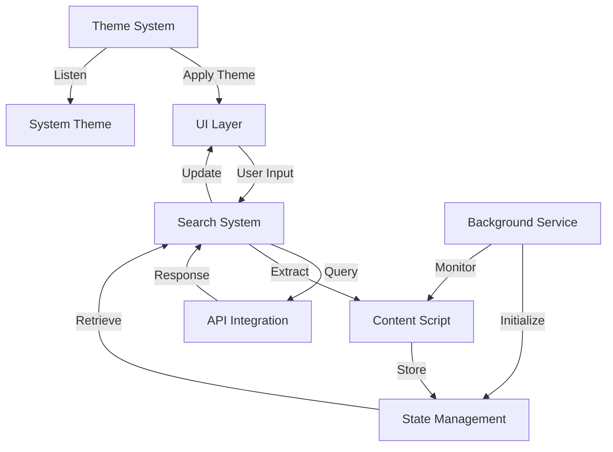
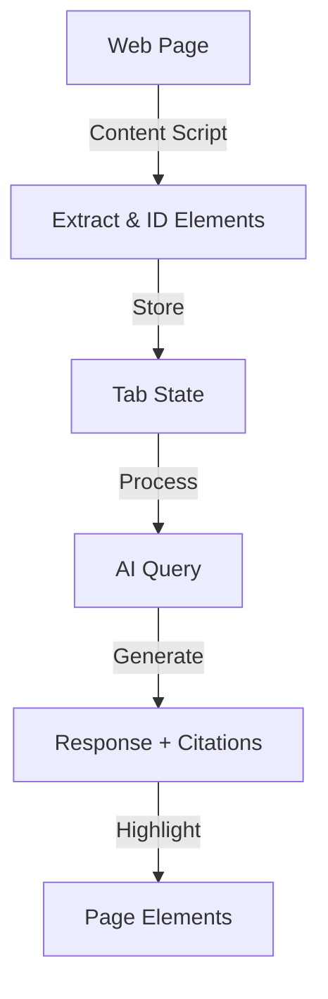

# Magellan Architecture

This document outlines the technical architecture of Magellan, with a focus on how we handle page data extraction, processing, and interaction.

## Overview

Magellan is built as a Chrome extension with a modular architecture organized into several key components:

### Core Components

1. **Background Service Worker** (`core/background.js`)

   - Manages extension lifecycle
   - Handles tab state initialization
   - Coordinates communication between components

2. **UI Layer** (`ui/`)

   - `sidebar.js` - Main sidebar interface and user interaction
   - `ui.js` - Reusable UI components and utilities
   - `theme.js` - Theme management and system theme synchronization

3. **Search System** (`search/`)

   - `search.js` - Core search implementation and AI query handling
   - `contentScript.js` - Page content extraction and interaction

4. **API Integration** (`api/`)

   - `api-key.js` - API key management and validation
   - `google-ai.js` - Google AI SDK integration and query handling

5. **State Management** (`state/`)

   - `tabState.js` - Tab-specific state management and persistence

6. **Core Utilities** (`core/`)
   - `utils.js` - Shared utility functions and helpers

### Component Interaction



## Page Data Flow



## Page Content Extraction

### Element Selection

We use a targeted approach to extract meaningful content:

```javascript
const selectors =
  "p, h1, h2, h3, h4, h5, h6, li, span, blockquote, td, th, pre," +
  "div:not(:has(p, h1, h2, h3, h4, h5, h6, li, article, section, main, aside, nav, header, footer, form)), " +
  "article, section, main";
```

This selector strategy:

- Prioritizes semantic HTML elements
- Excludes container elements that don't add value
- Captures both block and inline elements
- Avoids duplicate content

### Element Processing

Each element goes through several checks:

1. **Visibility Check**

   - Filters out hidden elements
   - Checks computed styles (display, visibility, opacity)
   - Verifies element dimensions
   - Excludes off-screen elements

2. **Content Validation**

   - Minimum text length: 15 characters
   - Maximum text length: 2500 characters per node
   - Filters out duplicate content
   - Removes empty or whitespace-only elements

3. **Element Identification**
   - Assigns unique IDs (`mgl-node-{counter}`)
   - Stores element references
   - Maintains parent-child relationships
   - Preserves DOM structure

### Content Storage

Extracted content is stored in two formats:

1. **Identified Elements**

```typescript
type IdentifiedElement = {
  id: string; // Unique identifier (e.g., "mgl-node-0")
  text: string; // Extracted text content
  element: Element; // Reference to DOM element
};
```

2. **Full Text Format**

```
[mgl-node-0] First paragraph text
[mgl-node-1] Second paragraph text
...
```

## State Management

### Tab State

Each tab maintains its own state:

```typescript
type TabState = {
  /** Chat conversation history between user and AI assistant */
  chatHistory: Array<{
    /** Role of the message sender - either user or AI assistant */
    role: "user" | "assistant";
    /** The actual message content */
    content: string;
    /** Optional citations from the page for assistant messages */
    citations?: Array<CitedSentence>;
    /** True if the answer comes from general knowledge rather than page content */
    isExternalSource?: boolean;
    /** True if user clicked "Prompt with GK" button for this message */
    gkPrompted?: boolean;
  }>;
  /** Currently active citations from the page that are being highlighted */
  citedSentences: Array<CitedSentence>;
  /** Index of the currently viewed citation in citedSentences array */
  currentCitedSentenceIndex: number;
  /** Current state of the extension's processing pipeline */
  status: "idle" | "extracting" | "querying_llm" | "ready" | "error";
  /** Error message if status is 'error', empty otherwise */
  errorMessage: string;
  /** Full text content extracted from the page, formatted for AI processing */
  fullPageTextContent: string;
  /** List of identified elements from the page with their IDs and text content */
  pageIdentifiedElements: Array<IdentifiedElement>;
};
```

### State Lifecycle

1. **Initialization**

   - Created when tab is activated
   - Persists until tab is closed
   - Maintains chat history and citations

2. **Updates**
   - Modified during content extraction
   - Updated with AI responses
   - Tracks citation navigation
   - Manages error states

## AI Integration

### Search Modes

Magellan supports three distinct search modes:

1. **Page Context Mode**

   - Searches only within the current page content
   - Requires relevant page content to be found
   - Provides citations from the page
   - Falls back to "no relevant content" message if nothing found

2. **General Knowledge Mode**

   - Uses only AI's general knowledge
   - Ignores page content completely
   - No citations provided
   - Always marked as external source

3. **Blended Mode**
   - First attempts to find relevant content on the page
   - Uses content relevance check to determine if page content is useful
   - If page content is relevant:
     - Provides answer with page citations
     - Marked as page context answer
   - If page content is not relevant:
     - Falls back to general knowledge
     - Marked as external source
     - No citations provided
   - Allows manual fallback to general knowledge via "Prompt with general knowledge" button

### Content Relevance Check

The blended mode uses a dedicated relevance check:

```javascript
async function isPageContentRelevant(query, pageContent) {
  const relevancePrompt = `
You are an AI assistant helping determine if a webpage's content is relevant to a user's question.
The user has asked: "${query}"

Here is the content from the webpage:
${pageContent}

Please determine if the webpage content is relevant to answering the user's question.
Respond with ONLY "RELEVANT" or "NOT_RELEVANT".
`;
  // ... implementation
}
```

### Query Processing

1. **Context Preparation**

   - Combines user query with page content
   - Formats element IDs and text
   - Maintains conversation history

2. **Prompt Structure**

```
You are an AI assistant helping a user understand the content of a webpage.
The user has asked: "{query}"

Here is the relevant text content extracted from the page. Each piece of text is preceded by its unique element ID in square brackets (e.g., [mgl-node-0]).

--- START OF PAGE CONTENT ---
{formattedContent}
--- END OF PAGE CONTENT ---

Please:
1. Provide a concise answer based *only* on the provided content
2. Identify up to {numCitations} element IDs that support your answer
```

### Response Handling

1. **Citation Extraction**

   - Parses AI response for element IDs
   - Validates IDs against stored elements
   - Creates citation objects
   - Handles both page context and general knowledge responses

2. **UI Updates**

   - Updates chat history with source indication (page context vs general knowledge)
   - Renders citations for page context answers
   - Manages highlights for page context answers
   - Updates navigation state
   - Shows appropriate status messages based on response source

3. **Response Types**
   - Page Context Response:
     - Blue header with "Answer from page context"
     - Includes citations and highlights
     - Shows "Prompt with general knowledge" button
   - General Knowledge Response:
     - Green header with "Answer from general knowledge"
     - No citations or highlights
     - No additional action buttons

## Highlight Management

### Highlight Types

1. **Cited Element Highlight**

   - Class: `mgl-cited-element-highlight`
   - Style: Light background with rounded corners
   - Purpose: Shows all cited elements

2. **Active Element Highlight**
   - Class: `mgl-active-element-highlight`
   - Style: Outline with shadow
   - Purpose: Indicates currently viewed citation

### Highlight Operations

1. **Application**

   - Injects CSS styles
   - Adds highlight classes
   - Maintains element references
   - Handles visibility toggling

2. **Navigation**
   - Scrolls to active element
   - Updates highlight states
   - Manages focus
   - Handles edge cases

## Performance Considerations

1. **Content Extraction**

   - Processes elements in batches
   - Uses efficient selectors
   - Implements early filtering
   - Caches results

2. **Memory Management**

   - Cleans up old highlights
   - Removes unused element IDs
   - Manages tab state lifecycle
   - Handles page unload

3. **UI Responsiveness**
   - Asynchronous processing
   - Progressive loading
   - Efficient DOM operations

## Security

1. **Content Isolation**

   - Sandboxed content scripts
   - Limited DOM access
   - Secure message passing
   - API key protection

2. **Data Handling**
   - Local storage only
   - No external data transmission
   - Secure API communication
   - Privacy-focused design

## Error Handling

1. **Extraction Errors**

   - Invalid selectors
   - DOM access issues
   - Content parsing failures
   - Memory constraints

2. **AI Integration Errors**

   - API failures
   - Invalid responses
   - Rate limiting
   - Network issues

3. **UI Errors**
   - Element not found
   - Navigation failures
   - State inconsistencies
   - Highlight issues

## Future Improvements

Please visit our [issues](https://github.com/magellan-extension/magellan/issues).

Contributions are welcome and greatly appreciated.

Feel free to suggest additional features as well.

Thanks!

## Component Details

### UI Layer (`ui/`)

The UI layer is responsible for all user interaction and presentation:

1. **Sidebar Component** (`sidebar.js`)

   - Manages the main extension interface
   - Handles user input and query submission
   - Displays chat history and responses
   - Controls search mode selection
   - Manages citation navigation

2. **UI Utilities** (`ui.js`)
   - Provides reusable UI components
   - Handles DOM manipulation
   - Manages highlight rendering
   - Controls animation and transitions

### Search System (`search/`)

The search system coordinates content extraction and AI queries:

1. **Search Implementation** (`search.js`)

   - Implements search modes (Page Context, Blended, General Knowledge)
   - Manages query processing
   - Handles response parsing
   - Coordinates with API integration

2. **Content Script** (`contentScript.js`)
   - Extracts page content
   - Manages element identification
   - Handles highlight management
   - Communicates with the main extension

### API Integration (`api/`)

Handles all external API interactions:

1. **API Key Management** (`api-key.js`)

   - Manages API key storage
   - Handles key validation
   - Provides key retrieval

2. **Google AI Integration** (`google-ai.js`)
   - Implements Google AI SDK integration
   - Manages API requests
   - Handles response processing
   - Implements retry logic

### State Management (`state/`)

The state management system maintains the application state:

1. **Tab State** (`tabState.js`)
   - Manages per-tab state
   - Handles state persistence
   - Coordinates state updates
   - Maintains chat history
   - Tracks citation state

### Core Utilities (`core/`)

Provides essential functionality used across components:

1. **Background Service** (`background.js`)

   - Manages extension lifecycle
   - Initializes tab states
   - Coordinates component communication
   - Handles extension events

2. **Utilities** (`utils.js`)
   - Provides shared helper functions
   - Implements common algorithms
   - Handles data formatting
   - Manages error handling

## Theme System

### Overview

The theme system provides consistent theming across all extension pages (sidebar, API key page) with support for:

- Light and dark themes
- System theme synchronization
- Theme persistence
- Automatic theme application

### Theme Storage

Themes are stored in Chrome's local storage:

```typescript
type ThemePreference = "light" | "dark" | "system";
```

### Theme Implementation

1. **Theme Module** (`theme.js`)

   - Centralized theme management
   - System theme detection
   - Theme persistence
   - Automatic theme application

2. **Theme Application**

   - Uses CSS variables for theme colors
   - Applies theme via `data-theme` attribute
   - Supports dynamic theme switching
   - Handles system theme changes

3. **Theme Variables**

   ```css
   :root[data-theme="light"] {
     --bg-primary: #ffffff;
     --bg-secondary: #f3f4f6;
     --text-primary: #1f2937;
     --text-secondary: #4b5563;
     /* ... other light theme variables ... */
   }

   :root[data-theme="dark"] {
     --bg-primary: #1f2937;
     --bg-secondary: #111827;
     --text-primary: #f9fafb;
     --text-secondary: #d1d5db;
     /* ... other dark theme variables ... */
   }
   ```

4. **Theme Features**
   - Automatic theme detection on page load
   - System theme synchronization
   - Theme persistence across sessions
   - Smooth theme transitions
   - Consistent styling across all pages
